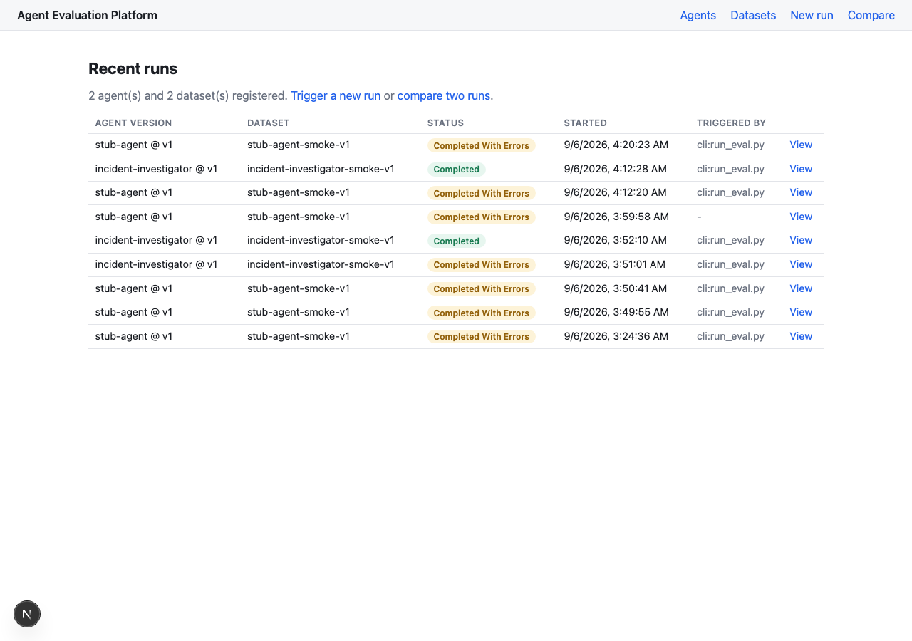
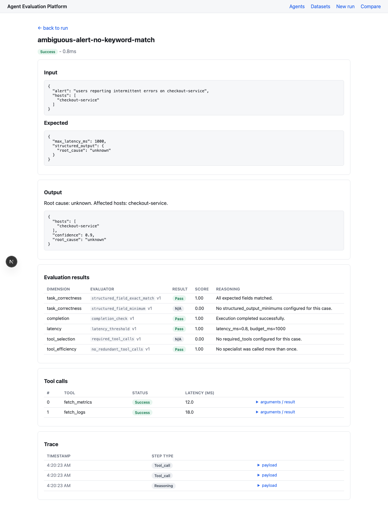

# Agent Evaluation Platform

A production-style platform for answering one question, reliably and repeatably:

> **When I change an AI agent, did it actually get better?**

Register an agent, define a dataset of known scenarios and expected behavior, run an
agent version against it, and score the results across several independent dimensions
(correctness, grounding, latency, tool use, ...) instead of collapsing everything into one
misleading number. Inspect any single failure down to its full execution trace and every
evaluator's reasoning. Diff two versions of an agent and see exactly which cases
regressed, not just whether an average moved.

**Status: all 5 planned phases complete, and deployed.** Design docs, 10 ADRs, two real,
structurally different agents integrated end to end, and a live Cloud Run deployment
(`agent-eval-api`) called by a real external client over the network with real
authentication - see [Guiding constraints](#guiding-constraints), [Deployment](#deployment),
and [Documentation](#documentation) below.

## What it does

1. **Register an agent and its versions.** An agent is a logical system under test (e.g.
   `incident-investigator`); each pinned build - a git ref, a prompt revision, a model
   swap - is a separate, immutable version.
2. **Define an evaluation dataset.** A named collection of cases, each an input plus the
   expected behavior, authored as a reviewable file rather than through a form.
3. **Run a version against a dataset.** The platform invokes the agent once per case
   through a thin adapter and normalizes whatever comes back into one common shape,
   regardless of how different the underlying agent is internally.
4. **Evaluate across independent dimensions.** Deterministic checks, rule-based checks
   over the execution trace, and an LLM-as-judge grounding check each report a score for
   exactly one dimension - never blended into a single "AI score."
5. **Inspect any failure.** Full input, expected behavior, actual output, execution trace,
   every tool call, and every evaluator's score and reasoning for one case.
6. **Compare two runs.** Regressions are surfaced case-by-case, before any aggregate -
   a version that improves the mean while breaking three specific cases has not
   unambiguously gotten better.

## Demo

*(A short walkthrough video will go here once recorded. In the meantime, two screenshots
of the real, running system:)*

**Recent runs, across both integrated agents:**



**Inspecting one case's full result - input, output, every evaluator's reasoning, tool
calls, and trace:**



## What's connected right now

| Agent | What it is | Adapter | Integrated |
|---|---|---|---|
| **Incident Investigation Platform** ([ai-operations-center](https://github.com/fegbewunmi/ai-operations-center)) | A LangGraph multi-agent incident investigator - a planner coordinates telemetry, deployment, and knowledge specialist agents, then synthesizes a root-cause hypothesis | `app/adapters/incident_investigator/` | Phase 2 |
| **Document Q&A** ([document-qa](https://github.com/fegbewunmi/document-qa)) | A single-call RAG app - hybrid retrieval + reranking, then a synthesized, cited answer or an honest refusal | `app/adapters/document_qa/` | Phase 5 |

Both run through the identical runner, evaluator, persistence, comparison, and frontend
code - the second integration required **zero changes** to any of it. See
[docs/phase-notes/phase-5.md](docs/phase-notes/phase-5.md) for what that actually proved,
and [docs/agent-integration.md](docs/agent-integration.md) for how to add a third.

## How it works

```
  Incident Investigation Platform        Document Q&A
   (LangGraph, polls for status)         (Express, single call)
              |                                |
              v                                v
   IncidentInvestigatorAdapter        DocumentQAAdapter
   (only file that knows                (only file that knows
    LangGraph exists)                    citations exist)
              |                                |
              +---------------+----------------+
                              |  normalize
                              v
                     AgentExecutionResult
                  (one shape, either agent)
                              |
                              v
     Runner  --score-->  Evaluators  --store-->  Persistence  --serve-->  API + Frontend
  (timeout +           (7 dimensions,           (Postgres,              (inspect,
   isolation)           deterministic /          immutable)               compare)
                         rule-based /
                         LLM-as-judge)
```

Everything above the "normalize" line is agent-specific and lives entirely inside one
adapter file. Everything below it has never heard of LangGraph, Gemini, or OpenAI, and
doesn't need to - see [docs/architecture.md](docs/architecture.md) for the full
component breakdown and failure-isolation design.

## Tech stack

| Layer | Technology |
|---|---|
| Backend | Python, FastAPI, SQLAlchemy, Alembic |
| Database | PostgreSQL (JSONB for variable-shape data) |
| Frontend | Next.js (App Router), TypeScript - server components only, no client-side state library |
| LLM-as-judge | Vertex AI Gemini, called independently of whatever LLM the agent under test uses |

No task queue, no Kubernetes, no billing/orgs/RBAC - see
[Guiding constraints](#guiding-constraints).

## Deployment

The backend is deployed to Cloud Run as `agent-eval-api` (`us-central1`), IAM-authenticated
- callers need a real Google-signed ID token from a service account granted
`roles/run.invoker`, not a public endpoint. This was done for a real external caller (the
[Orion Agent Developer Platform](../agent-dev-platform)) to integrate against a genuinely
running, network-reachable service rather than a local instance. Full deployment
architecture, exact config, service-to-service auth, known limitations, and live
verification evidence: [`docs/phase-notes/deployment.md`](docs/phase-notes/deployment.md)
and [ADR-0010](docs/adr/0010-cloud-run-deployment.md).

**The frontend is not deployed** - only the backend API has a live target. The `docker
run` / local Postgres path below remains the only way to run the frontend or to develop
against this platform locally; deployment did not change local development at all (same
commands, same `.env` files - see `docs/phase-notes/deployment.md`'s "what stayed
unchanged").

## Local setup

Full instructions, env vars, and how to point either adapter at a real running target
system are in [`backend/README.md`](backend/README.md) and
[`frontend/README.md`](frontend/README.md). Quick start:

```bash
# Backend
cd backend
uv sync --group dev
cp .env.example .env
uv run alembic upgrade head
uv run uvicorn app.main:app --port 8000

# Frontend (separate terminal)
cd frontend
npm install
cp .env.local.example .env.local
npm run dev   # http://localhost:3000
```

## Run an evaluation

```bash
# Against the free, dependency-free stub agent
uv run python scripts/run_eval.py \
  --dataset-file datasets/stub-agent/smoke-v1/cases.yaml \
  --agent-version v1

# Against a real integrated agent (requires that system running locally)
uv run python scripts/run_eval.py \
  --dataset-file datasets/document-qa/resume-v1/cases.yaml \
  --agent-name document-qa --adapter-key document-qa \
  --agent-version v1 \
  --agent-config '{"base_url": "http://localhost:3001"}'
```

Prints a per-case, per-dimension summary. The same run is also triggerable through the API
(`POST /runs`) or the frontend's "New run" page - or against the deployed backend directly
with a valid ID token in the `Authorization` header (see
[`docs/phase-notes/deployment.md`](docs/phase-notes/deployment.md) for exactly how to mint
one and which requests actually work against it today).

## Documentation

| Doc | Purpose |
|---|---|
| [docs/product-overview.md](docs/product-overview.md) | Problem, users, workflows, MVP scope |
| [docs/architecture.md](docs/architecture.md) | Components, responsibilities, data flow, failure boundaries |
| [docs/domain-model.md](docs/domain-model.md) | Entities, relationships, and changes to the proposed model |
| [docs/evaluation-architecture.md](docs/evaluation-architecture.md) | Evaluator categories and when to use each |
| [docs/agent-integration.md](docs/agent-integration.md) | The adapter interface that keeps the platform agent-agnostic |
| [docs/tech-stack.md](docs/tech-stack.md) | Technology choices and why nothing more was added |
| [docs/repository-structure.md](docs/repository-structure.md) | Repo layout |
| [docs/evaluation-methodology.md](docs/evaluation-methodology.md) | How agent quality is measured without a single misleading score |
| [docs/dataset-authoring.md](docs/dataset-authoring.md) | How to write and load an evaluation dataset |
| [docs/roadmap.md](docs/roadmap.md) | Phased implementation plan (all 5 phases complete) |
| [docs/open-questions.md](docs/open-questions.md) | Assumptions and unresolved questions, tracked explicitly |
| [docs/adr/README.md](docs/adr/README.md) | Architecture Decision Record index (10 ADRs) |
| [docs/phase-notes/](docs/phase-notes/) | What was actually built and verified, phase by phase, including real bugs found |
| [docs/phase-notes/deployment.md](docs/phase-notes/deployment.md) | The Cloud Run deployment: architecture, auth, config, live verification, a real confirmed limitation |

## Guiding constraints

These were set at the outset and shape every decision in this repo:

- Not a commercial SaaS product: no billing, no organizations, no complex RBAC.
- No Kubernetes, no distributed task queues, no unnecessary infrastructure.
- The evaluation platform does **not** use LangGraph, even though the first target system
  (an Incident Investigation Platform) does. The platform must stay agent-agnostic -
  proven in Phase 5 by integrating a second, structurally unrelated agent with zero
  platform-core changes.
- Prefer simple, explicit abstractions over speculative generality.
- Where a decision has real tradeoffs, it is recorded (see `docs/adr/`) rather than
  silently picked.
